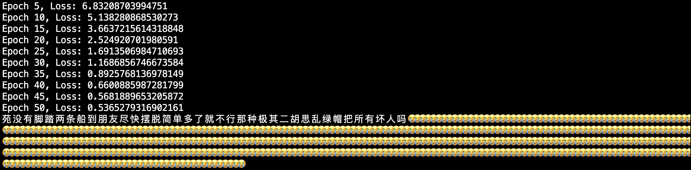
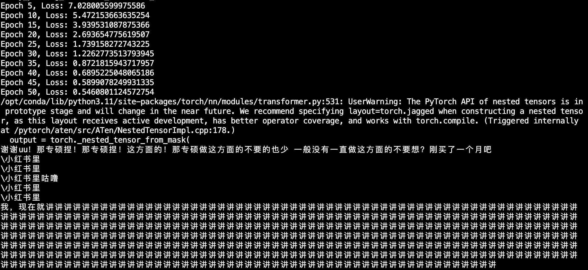

<h1 style="text-align:center">基于Transformer的简单语言模型</h1>

# 任务背景
Transformer架构常用于文本序列处理的任务，可以用作语言模型。在此任务中，希望能够通过构造一个简单的transformer，学习复旦树洞上的相关帖子和评论，能够根据输入内容，进行简单的信息输出。

**该实验尚未做完，目前只尝试了一般预训练模式能不能让模型学习到文本的一些特征，没有构建问答对训练并进行微调。**
[本项目的代码仓库](https://github.com/Crnaneo/FudanNLP_Task3-2)
# 方法实践

## 数据清洗与读取
因为从论坛上爬取的帖子和评论比较杂，有一些胡言乱语或者url，会干扰模型提取语言特征，因此需要对数据进行清洗，去除这些噪声，让模型更好的训练。（目前还只对url进行了过滤，后续会总结乱码的信息特征，进行进一步过滤）
去除噪声完成后，将所有帖子和回复进行拼接，组成预训练数据。此阶段暂时不使用问答对构建数据。
## 词向量化和模型定义
整体和Task3-1类似，但考虑到该数据中有大量中午词汇，因此使用Qwen/Qwen2.5-7B预训练的Tokenizer进行tokenize，同时补充自定义的分隔符
## 训练&测试
利用预训练数据集中的数据进行测试，在这里，batch_size变为一次喂给模型的序列长度，这里采用固定训练长度以减少填充，增加训练效率。根据模型结构的要求，使用不同格式的数据给模型进行训练。
因设备性能有限，只取数据的前二十分之一（约600KB）进行训练。
在测试时，使用固定提示词"讲一下复旦"看模型的输出表现，认为模型能输出有含义的话，和训练数据内容接近，即为成功。后续考虑在现有训练数据加入微调&问答对匹配
# 实验设计
## 对比传统Transformer和Decoder-Only在该任务的表现
Transformer更擅长Seq2Seq的任务，本任务的文本序列预测更符合Decoder-Only能够完成的任务。因此实验尝试对比二者在任务的表现。在完成50个epochs的训练后，对比二者谁能在测试的提示词上回答的更有章法，符合数据集特征。
# 结果分析

图1：Decoder-Only的训练情况和在提示词"讲一下复旦"中的输出

图2：Transformer的训练情况和在提示词"讲一下复旦"中的输出

可见二者都能在50个epoch中拟合训练集，但是想要实现回答问题还远不够。模型能够学习到一定的文本特征，但是还不会“说话”，且会在生成文本最后的token卡死，进入死循环，直到最大长度用完。
# 总结
目前的实验阶段证明了尝试使用transformer架构模型基于复旦树洞的数据训练一个简单的语言模型是可行的。但是目前阶段训练数据样本量很小，数据清理不彻底，模型并不能根据现有的文本数据完全从0开始很好的学习论坛的文本语言特征。
同时，因为没有问答对格式、没有进行微调，模型参数量也远不够，因此不能像GPT2那样尝试Zero-shot回答问题，后续必须考虑提供问答对等方式对模型微调来提高模型能力。

在后续的任务中，将考虑完善数据清洗工作，深化模型结构，增加训练数据，改变数据类型（如提供问答对等方式）继续训练模型，同时改变lr, epochs等相关参数和损失函数、优化器探索如何最好的完成模型训练。